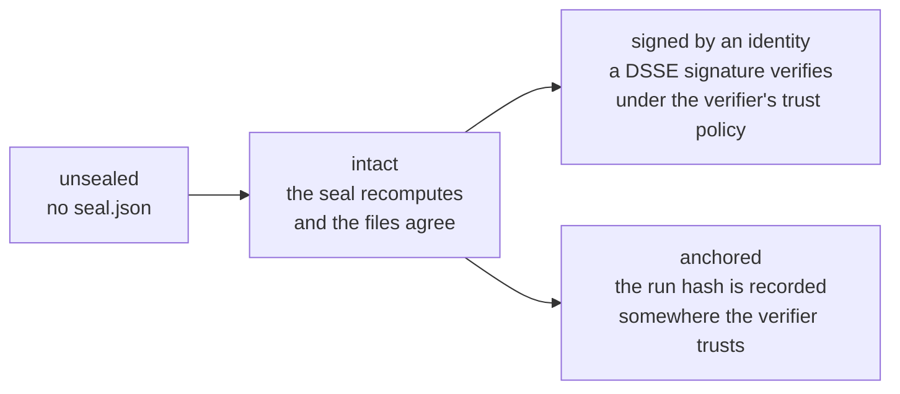
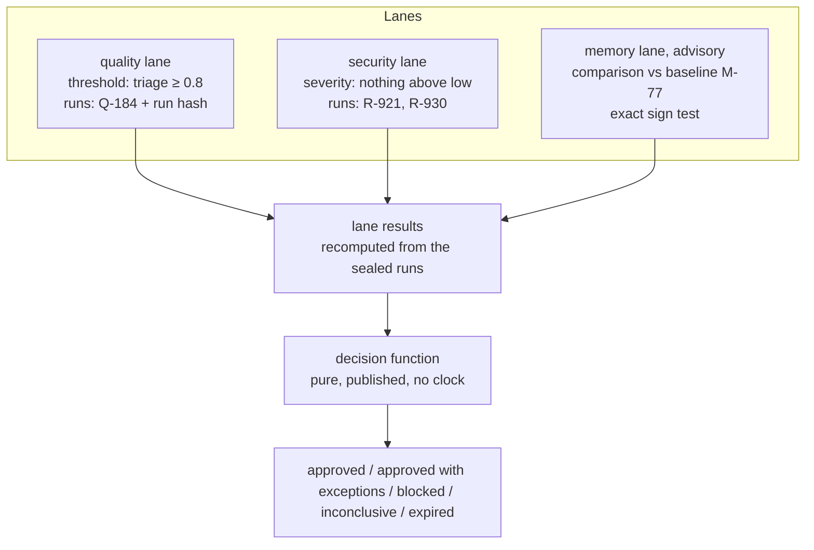

# AEF primer

*Informative. The [specification](spec/01-introduction.md) is the rule; this page is a tour of it, built on one run
from the conformance corpus: [`conformance/valid/completed-eval/run/`](conformance/valid/completed-eval/run/).*

## What AEF is for

An evaluation of an AI agent ends in a claim: *version 3f2a1c passed the triage suite*, *the red-team campaign found
nothing critical*, *the release was approved*. Usually only the tool that made the claim can show why. AEF is a file
format that lets **anyone else** check three things:

1. **The evidence is the evidence.** A run is a folder of plain files, sealed over their exact bytes. Change one byte
   and recomputing the seal shows it. Sign the seal and the sealer is known too.
2. **The decision follows from the evidence.** A release decision names the exact sealed runs it used, and a
   published, pure function turns their results into the outcome. Anyone can recompute it.
3. **A runner did what it was asked.** When someone else runs the evaluation, their event stream can be checked
   against the plan they were given.

AEF does not say whether an evaluation was well designed. It makes what ran, what came out and what was decided
inspectable, so that anyone can judge it.

## 1. A run is a folder

```
completed-eval/run/
├── run.json                 who produced it, what was evaluated, how, when, what content was kept
├── results.ndjson           one line per node of the result tree
├── metrics.json             every metric the results name: kind, direction, scale
├── summary.json             the results rolled up per lane, metric and path
├── evidence.ndjson          what results cite: spans, blobs, documents
├── gates.ndjson             decisions the producer took when the run closed (a CI gate)
├── traces.otlp.jsonl        OpenTelemetry traces (OTLP/JSON)
├── blobs/sha256/63/635221…  raw bytes, named by their SHA-256 (here: a judge's reasoning)
├── seal.json                the seal: the SHA-256 of every file above
└── overlays/                added after the run closed: approvals, waivers, notes
    ├── events.ndjson
    ├── seal-0001.json
    └── seal-0002.json
```

Nothing about the folder's name or location matters: a reader finds runs by looking for `run.json` ([RUN-1]). The
files are JSON or NDJSON in UTF-8, with LF line endings and no duplicate keys ([ENC-1]–[ENC-7]), so that every reader
reads the same bytes the same way.

### `run.json`: the header

The parts a reader needs first:

| Field | In this run | Why it matters |
|---|---|---|
| `subject` | `agent:support/support-triage`, version `git:3f2a1c` | What was evaluated, exactly. A checkpoint decides on one exact version. |
| `execution.targetMode` | `live` | Required. Only `live` evidence says how the subject behaves now; `replayed`, `scripted` and `mocked` runs say something else, and a reader shows which ([RUN-7]). |
| `suite` | `suite:support/triage-scenarios` v4, with its content digest | Which cases ran. AEF does not define the cases, only names them. |
| `judges` | `gpt-5.1`, with a rubric digest and its measured agreement with labelled cases | Who graded. The calibration is the producer's claim, shown as such ([RUN-9]). |
| `contentCapture` | `on` | Whether prompts, replies and reasoning are kept. With `off`, neither the text nor any hash of it is ([RUN-11]). |

### `results.ndjson`: the result tree

Each line is one node. This run's case 17 is a composite with three children:

```
case-17  triage              failed   0.55   (WeightedSum of its children)
├── triage/policy            passed   1.00   code check
├── triage/helpfulness       failed   0.10   LLM judge, reasoning in a blob, severity medium
└── triage/groundedness      not_applicable  "No retrieved context was recorded for this case"
```

One line, shortened:

```json
{"resultId":"r_1264eeb3…","parentResultId":"r_479d157f…","caseId":"case-17","path":"triage/helpfulness",
 "state":"failed","severity":"medium","scores":[{"metric":"helpfulness","value":0.1}],
 "annotator":{"kind":"LLM","model":"gpt-5.1","rubricDigest":"sha256:29fd…"},
 "reasoning":{"blob":"sha256:635221…","bytes":122},"traceLink":{"traceId":"4bf9…","spanId":"00f0…"}}
```

Three ideas carry most of the format:

- **Ten states, and absence is typed.** Besides `passed`, `failed`, `warn`, `inconclusive` and `scored` (measured,
  with no pass/fail rule), a result can be `not_measured`, `not_applicable`, `skipped`, `error` or `pending`. Those five are *typed absences*: they carry a
  `reason`, never a score, and they are never counted as a pass or as a zero ([RES-1], [RES-2]). A judge that timed
  out is an `error`, not a 0.
- **Ids are computed, not invented.** `resultId` is a hash of the run id, case id, path and trial, so the same run read
  twice gives the same ids ([RES-4]).
- **Aggregation is descriptive.** A composite records how the producer reached its state (`strategy`, `rulePath`, the
  `decisive` children). AEF does not define the formula, and a reader never recomputes it ([RES-6]).

### `summary.json`: defined exactly

The summary is what release decisions read, so its numbers follow from the results by rule ([SUM-3]–[SUM-5]). For the
metric `triage` at path `triage`, this run has six cases: 0.55 and 0.78 were measured; one is `inconclusive` with no
score; three are typed absences.

```
N = 6 lines, n = 2 measured, notMeasured = 4, sum = 1.33, value = 1.33 / 2 = 0.665
```

The `groundedness` entry has `N = 0`: its only line is `not_applicable`, which is left out. Its value is `null` and its
verdict `not_measured`: nothing measured is never a pass ([SUM-6]). A verifier recomputes every entry.

## 2. Sealing: the evidence is the evidence

When the run closes, the sealer lists every file with its SHA-256 and size, sorted by the bytes of the path ([SEAL-3]):

```
635221c9…5fef5  122  blobs/sha256/63/635221c9…5fef5
f76af41e…108b1  489  evidence.ndjson
6db8527c…b9c63  339  gates.ndjson
cd5980b5…9ef87  810  metrics.json
08719682…36e5c  4023  results.ndjson
6833f5f2…c1f5c  1863  run.json
268eda20…14679  1180  summary.json
3c29fa78…98787  1018  traces.otlp.jsonl
```

The SHA-256 of that text is the **run hash**: it identifies this run's exact content ([SEAL-4]). `seal.json` is an
[in-toto](https://github.com/in-toto/attestation) Statement whose subjects are the files and whose predicate repeats
the run hash with the header facts ([SEAL-5]). The full manifest is in
[`conformance/seal-vectors/completed-eval/expected-manifest.txt`](conformance/seal-vectors/completed-eval/expected-manifest.txt).

There is no canonical JSON: files are sealed as they are. The blob in this run holds non-ASCII text and a CRLF on
purpose, and the corpus is stored byte-exact (`.gitattributes`) to prove the seal survives.

### What a seal proves, and what it does not

Anyone can edit a file and re-seal. A seal alone proves the files are consistent with each other; it does not prove
who made them. AEF names four levels and never lets a reader blur them ([SIG-7]):



- **Signed.** `attestation.dsse.json` is a [DSSE](https://github.com/secure-systems-lab/dsse) envelope over the exact
  bytes of `seal.json`. Verifiers must support ECDSA P-256 and should support Ed25519 ([SIG-2]). Which keys to trust is
  the verifier's input, never something the run says about itself ([SIG-4]).
- **Anchored.** A signed checkpoint that lists this run with its run hash anchors it: someone cannot later substitute a
  different run with the same id ([SIG-8]).

[§8](spec/08-security.md) lists the threats each level does and does not address.

## 3. Overlays: what happens after the run

A closed run never changes ([RUN-4]). What people decide about it later goes in `overlays/events.ndjson`: approvals,
rejections, overrides, adjudications, waivers with an expiry, notes, and redactions. Events are appended in batches;
each batch is sealed (`seal-0001.json`, `seal-0002.json`, …), bound to the run hash, and chained to the previous batch
seal ([OVL-4]). Altering or removing an event inside a sealed batch breaks the chain ([OVL-5]). Removing the newest
batches together with their seals leaves a shorter chain that still verifies: a signed batch, or a copy held
elsewhere, shows it.

A reader shows the **effective view**: the sealed states, plus what verified overlays say about them ([§4.3](spec/04-integrity.md)).

| Event | Effect in the view |
|---|---|
| `override`, `adjudicate` | the result's effective state (the sealed state is shown beside it) |
| `approve`, `reject` | the review status of the run or a result |
| `waive` | active from `at` until `expires`, then shown as expired |
| `redact` | a blob is withheld: it may be deleted, and the seal reports it as `withheld`, not `missing`, but only when the batch is signed by someone the verifier's trust policy allows to redact |

Redaction is how personal data captured in a blob is erased without breaking the seal ([OVL-10]). An unsigned or
unauthorized redaction withholds nothing: the deleted blob is missing and the run fails, so no one can suppress
evidence by appending an event. Summaries, gate
decisions and lane results are never recomputed from overlays: they describe the sealed run.

## 4. Checkpoints: the decision follows from the evidence

A checkpoint is a release decision for **one exact version** over several kinds of evidence, called lanes.



1. **Each lane names its rule and its exact runs, by run hash** ([CKP-2]). A run changed after the checkpoint was made
   is still found by its seal's run hash, and reported as not intact, so its evidence no longer counts ([CKP-8]).
2. **A lane's result is a function of its sealed runs** ([§5.3](spec/05-checkpoints.md)). A `threshold` reads a summary
   entry. A `severity` rule looks at every failure, and a failure without a severity counts as critical. An
   `evidence-present` rule counts eligible runs. A `comparison` runs an exact one-sided sign test against one baseline
   run, and refuses to compare runs that differ on the axes it names (judges, rubrics, target mode…). Only intact,
   completed, `live` runs are eligible.
3. **The decision function turns lane results into an outcome** ([§5.4](spec/05-checkpoints.md)). Missing evidence is
   never converted into a pass, a failed blocking lane blocks, stale evidence expires the checkpoint, and nothing is
   averaged. Its input and output are recorded in the manifest, so anyone can recompute it.
4. **A decided checkpoint is signed** ([CKP-5]); verified, it anchors every run it names.

[`conformance/checkpoints/valid-decided/document.json`](conformance/checkpoints/valid-decided/document.json) is a
complete example: two lanes passed and the advisory memory lane has no evidence yet, so the outcome is
`inconclusive`.

## 5. Runners

When an evaluation is delegated, the delegating side writes a **run plan** (what to evaluate, the budget, the
limits, credentials only as references) and the runner publishes a **manifest** (what it can run). A runner reports an
**event stream**: `job.accepted` (or `job.refused`), `plan.estimated`, `spend.updated`, `case.completed`,
`lane.completed`, `evidence.produced` for each sealed run, and one terminal event (`job.sealed`, `job.failed`,
`job.cancelled`). A stream verifier checks the stream
against the plan: budget kept, limits kept, every announced run sealed ([§6](spec/06-runners.md)).

## 6. Reading tolerantly, writing strictly

Producers write against the strict **writer** schemas. Readers use the **reader** schemas, derived from them, which
accept what a later 1.x may add: unknown fields, and unknown enum values, each read as its safest known value (an
unknown target mode as `mocked`, an unknown gate outcome as `inconclusive`) ([§7.3](spec/07-versioning.md)). Three
enums the checks compute with (a result's state, a run's status, a metric's kind) are closed for 1.x, so no later
minor can surprise them ([VER-9]). An unknown major version is refused.

## 7. Trying it

The reference tools are standard-library Python in [`../tools/`](../tools/):

| Tool | Does |
|---|---|
| `aef_verify.py run DIR` | verifies a run: encoding, schemas, the rules across files, the seal; prints the outcome and every problem |
| `aef_verify.py lanes CHECKPOINT --runs DIR` | recomputes a checkpoint's lane results from its runs |
| `aef_decide.py` | the decision function |
| `aef_stream.py` | the stream verifier |
| `aef_conformance.py` | runs the conformance corpus against the reference verifier, or against your implementation |
| `aef_schema.py` | a JSON Schema validator with the portable pattern semantics AEF requires |
| `aef_crypto.py` | DSSE, ECDSA P-256 and Ed25519 |

To write your first run: produce `run.json`, `results.ndjson`, `metrics.json` and `summary.json` against the writer
schemas; compute each `resultId` with [RES-4]; close the run; seal it with [SEAL-1]–[SEAL-5]. Then check it with
`aef_verify.py run`. The [conformance corpus](conformance/) holds a valid example of every file, and a broken one for
every rule a file can show broken (`tools/check_spec.py` lists the few rules no vector can test, and why).

## Where next

- [The specification](spec/01-introduction.md), starting with the conformance classes in §1.7.
- [Rationale and FAQ](rationale.md): why AEF made the choices it did.
- [Interoperability](interop/): how AEF maps to OpenTelemetry, Inspect, OpenAI Evals and EvalPort.
- [Field reference](reference/): every field, generated from the schemas.
